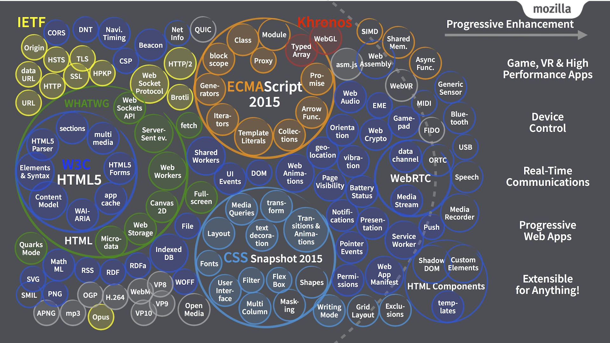

# Web API spec Short URL (http://webapi.link/...) link list

## HTML
* [WHATWG HTML (Living Standard)](http://webapi.link/html)
* [W3C HTML](http://webapi.link/w3chtml)
  * [W3C HTML5](http://webapi.link/html5)
  * [W3C HTML5.1](http://webapi.link/html51)
  * [W3C HTML5.2](http://webapi.link/html52)

## CSS
* [CSS](http://webapi.link/css)
  * [CSS Snapshot 2017](http://webapi.link/css2017)
  * [CSS Snapshot 2015](http://webapi.link/css2015)
  * [CSS Snapshot 2010](http://webapi.link/css2010)
  * [CSS Snapshot 2007](http://webapi.link/css2007)
  * [CSS Level 2 Revision 2 (CSS 2.2)](http://webapi.link/css22)
  * [CSS Level 2 Revision 1 (CSS 2.1)](http://webapi.link/css2)

* Layout
  * [CSS Exclusions Module Level 1](http://webapi.link/exclusions)
  * [CSS Grid Layout Module](http://webapi.link/grid)
  * [CSS Flexible Box Layout Module](http://webapi.link/flexbox)
  * [CSS Masking Module Level 1](http://webapi.link/masking)
  * [CSS Multi-column Layout Module](http://webapi.link/multicol)
  * [CSS Regions Module Level 1](http://webapi.link/regions)
  * [CSS Shapes Module Level 1](http://webapi.link/shapes)
  * [CSS Writing Modes Level 3](http://webapi.link/writingmodes)

* [CSS Animations](http://webapi.link/cssanimations)
* [CSS Backgrouds and Borders (Level 3)](http://webapi.link/background)
* [CSS Basic User Interface Module Level 3 (CSS3 UI)](http://webapi.link/cssui)
* [CSS Color Module Level 3](http://webapi.link/color)
* [CSS Color Module Level 4](http://webapi.link/color4)
* [Filter Effects Module Level 1](http://webapi.link/filters)
* [CSS Fonts Module Level 3](http://webapi.link/fonts)
* [CSS Image Values and Replaced Content Module Level 3](http://webapi.link/cssimages)
* [CSS Image Values and Replaced Content Module Level 4](http://webapi.link/images4)
* [Media Queries (Level 3)](http://webapi.link/mediaqueries)
* [Media Queries Level 4](http://webapi.link/mediaqueries4)
* [CSS Paged Media Module Level 3](http://webapi.link/page)
* [CSS Ruby Layout Module Level 1](http://webapi.link/cssruby)
* [Selectors Level 3](http://webapi.link/selectors)
* [Selectors Level 4](http://webapi.link/selectors4)
* [CSS Text Decoration Module Level 3](http://webapi.link/textdecor)
* [CSS Transforms Module Level 1](http://webapi.link/transforms)
* [CSS Transitions](http://webapi.link/transitions)
* [CSS Values and Units Module Level 3](http://webapi.link/values)
* [CSS Will Change Module Level 1](http://webapi.link/willchange)

## DOM
* [DOM](http://webapi.link/dom)

## JavaScript
* [ECMAScript 201x (latest draft)](https://tc39.github.io/ecma262/)
  * [ECMAScript 2016](http://webapi.link/ecma2016) = [ECMAScript 7th Edition](http://webapi.link/ecma7)
  * [ECMAScript 2015](http://webapi.link/ecma2015) = [ECMAScript 6th Edition](http://webapi.link/ecma6)
  * [ECMAScript 5.1th Edition](http://webapi.link/ecma51)
  * [ECMAScript 5th Edition (PDF)](http://webapi.link/ecma5)
* [asm.js](http://webapi.link/asmjs)
* [WebAssembly (design)](http://webapi.link/webassembly)

## Application Platform / System
* [Web Animations](http://webapi.link/animations)
* [Web Budget](http://webapi.link/budget)
* [FIDO 2.0: Web API for accessing FIDO 2.0 credentials](http://webapi.link/fido)
* [File API](http://webapi.link/file)
* [FileSystem API](http://webapi.link/filesystem)
* [Fullscreen API (Living Standard)](http://webapi.link/fullscreen)
* [Gamepad](http://webapi.link/gamepad)
* [Indexed Database API](http://webapi.link/indexeddb)
  * [Indexed Database API 2.0](http://webapi.link/indexeddb2)
* [Media Source Extensions](http://webapi.link/media-source)
* [Notifications API](http://webapi.link/notifications)
* [Permissions API](http://webapi.link/permissions)
* [Pointer Lock](http://webapi.link/pointerlock)
* [Presentation API](http://webapi.link/presentation)
* [Push API](http://webapi.link/push)
* [Quota Management API](http://webapi.link/quota)
* [Service Workers](http://webapi.link/serviceworkers)
* [Storage (Living Standard)](http://webapi.link/storage)
* [Streams (Living Standard)](http://webapi.link/streams)
* [Web Cryptography API](http://webapi.link/webcrypto)
* [Web Storage (W3C)](http://webapi.link/webstorage)
* [Visual Viewport API](http://webapi.link/viewport)
* [Web Workers](http://webapi.link/workers)

## Communications / Network
* [Beacon](http://webapi.link/beacon)
* [Brotli Compressed Data Format (RFC 7932)](http://webapi.link/brotli)
* [Cookie: HTTP State Management Mechanism (RFC 6265)](http://webapi.link/cookie)
* [Fetch (Living Standard)](http://webapi.link/fetch)
* [Network Information](http://webapi.link/netinfo)
* [TCP and UDP Socket API](http://webapi.link/sockets)
* [The WebSocket API](http://webapi.link/websocket)
* [WebRTC 1.0: Real-time Communication Between Browsers](http://webapi.link/webrtc)
* [XMLHttpRequest](http://webapi.link/xhr)

## Payment
* [Basic Card Payment](http://webapi.link/basiccard)
* [Payment Handler API](http://webapi.link/paymenthandler)
* [Payment Method Identifiers](http://webapi.link/paymentid)
* [Payment Request API](http://webapi.link/paymentrequest)
* [Web Payments HTTP API](http://webapi.link/paymentshttpapi)
* [Web Payments HTTP Messages](http://webapi.link/paymentshttpmessages)

## Sensor / Device / Hardware
* [Ambient Light Sensor](http://webapi.link/ambientlight)
* [Battery Status API](http://webapi.link/battery)
* [Web Bluetooth](http://webapi.link/bluetooth)
* [Device Memory](http://webapi.link/devicememory)
* [Geolocation API](http://webapi.link/geolocation)
* [Web GPIO API](http://webapi.link/gpio)
* [Web I2C API](http://webapi.link/i2c)
* [Web MIDI API](http://webapi.link/midi)
* [Web NFC API](http://webapi.link/nfc)
* [DeviceOrientation Event](http://webapi.link/orientation)
* [Proximity Sensor](http://webapi.link/proximity)
* [Screen Orientation API](http://webapi.link/screenorientation)
* [Vibration](http://webapi.link/vibration)

## Audio / Image / Video / 3D
* [Media Session Standard](http://webapi.link/mediasession)
* [MediaStream Image Capture](http://webapi.link/mediacaptureimage)
* [Media Source Extensions](http://webapi.link/mediasource) ([MSE](http://webapi.link/mse))
* [Opus Audio Codec (RFC 6716)](http://webapi.link/opus)
* [Portable Network Graphics (PNG)](http://webapi.link/png)
  * [Animation PNG (APNG)](http://webapi.link/apng)
* [Shape Detection](webapi.link/shapedetection)
* [Scalable Vector Graphics (SVG)](http://webapi.link/svg)
* [Scalable Vector Graphics (SVG) 2](http://webapi.link/svg2)
* [VP9 Video Codec](http://webapi.link/vp9)
* [Web Audio API](http://webapi.link/webaudio)
* [WebGL](http://webapi.link/webgl)
* [WebGL 2](http://webapi.link/webgl2)
* [WebM (WebM Container Guidelines)](http://webapi.link/webm)
  * [Matroska](http://webapi.link/matroska)
* [WebVR](http://webapi.link/webvr)

## Security and Identity
* [Content Security Policy](http://webapi.link/csp)
  * [Content Security Policy Level 1](http://webapi.link/csp1)
  * [Content Security Policy Level 2](http://webapi.link/csp2)
  * [Content Security Policy Level 3](http://webapi.link/csp3)
* [Cross-Origin Resource Sharing](http://webapi.link/cors)
* [HTTP Strict Transport Security (HSTS, RFC 6797)](http://webapi.link/hsts)
* [Public Key Pinning Extension for HTTP (RFC 7496)](http://webapi.link/hpkp)
* [Referrer Policy](http://webapi.link/referrerpolicy)
* [Subresource Integrity](http://webapi.link/sri)

* [Credential Management Level 1](http://webapi.link/credentialmanagement)
* [Web Authentication: An API for accessing Public Key Credentials Level 1](http://webapi.link/webauthn)

## Performance and Timing
* [Frame Timing](http://webapi.link/frametiming)
* [High Resolution Time](http://webapi.link/hrtime)
  * [High Resolution Time Level 1 (outdated)](http://webapi.link/hrtime1)
  * [High Resolution Time Level 2](http://webapi.link/hrtime2)
* [Navigation Timing](http://webapi.link/navigationtiming)
  * [Navigation Timing Level 2](http://webapi.link/navtiming2)
* [Page Visibility](http://webapi.link/pagevisibility)
* [Paint Timing](http://webapi.link/painttiming)
* [Performance Timeline](http://webapi.link/perftimeline)
  * [Perfromance Timeline Level 2](http://webapi.link/perftimeline2)
* [Resource Timing](http://webapi.link/resourcetiming)
  * [Resource Timing Level 1](http://webapi.link/resourcetiming1)
  * [Resource Timing Level 2](http://webapi.link/resourcetiming2)
* [User Timing](http://webapi.link/usertiming)

## other specs
* [Web App Manifest](http://webapi.link/manifest)
* [Compatibility (Living Standard)](http://webapi.link/compat)
* [Console (Living Standard)](http://webapi.link/console)
* [Tracking Preference Expression (DNT)](http://webapi.link/dnt)
* [Encoding (Living Standard)](http://webapi.link/encoding)
* [Web IDL](http://webapi.link/webidl)
* [MathML](http://webapi.link/mathml)
  * [MathML 2](http://webapi.link/mathml2)
  * [MathML 3](http://webapi.link/mathml3)
* [microformats2](http://webapi.link/microformats2)
* [The Web Robots Pages (robots.txt)](http://webapi.link/robotstxt)
* [Web Share API](http://webapi.link/webshare)
* [URL (Living Standard)](http://webapi.link/url)
